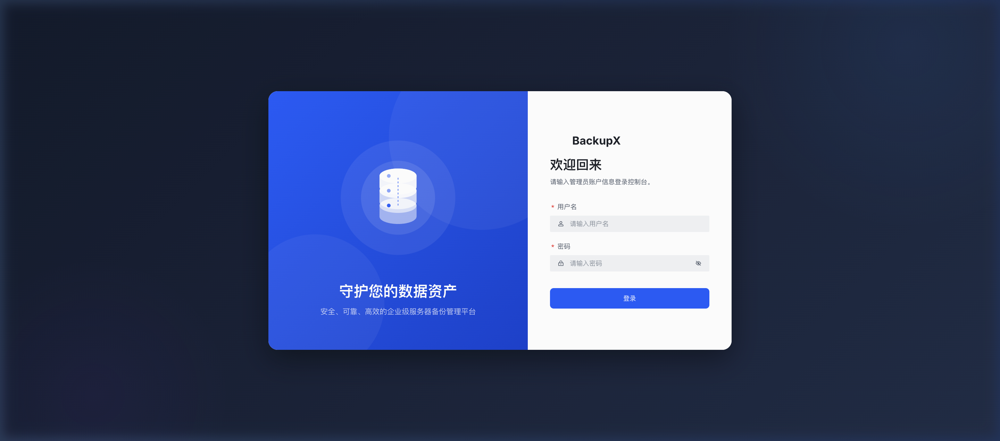
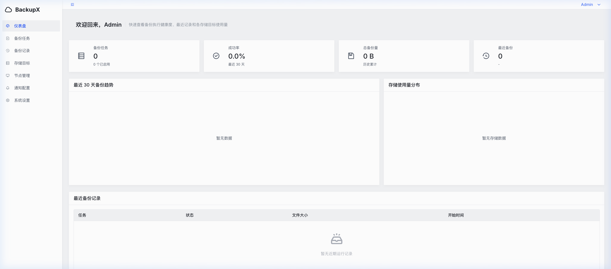
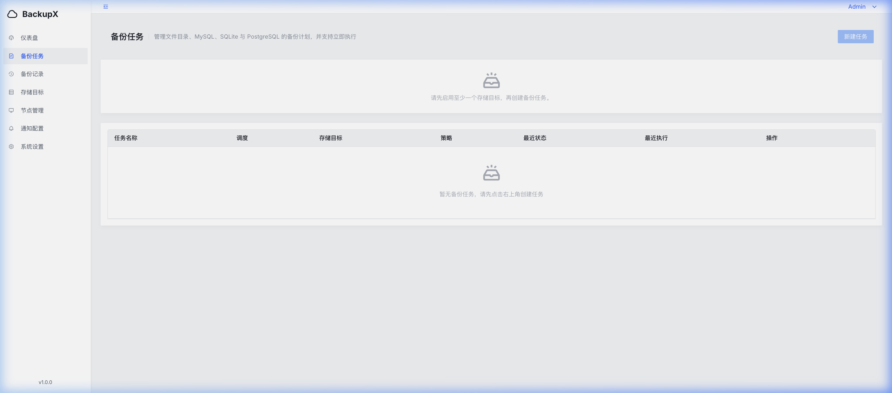
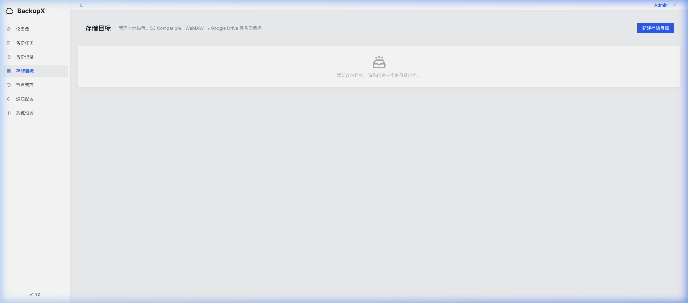
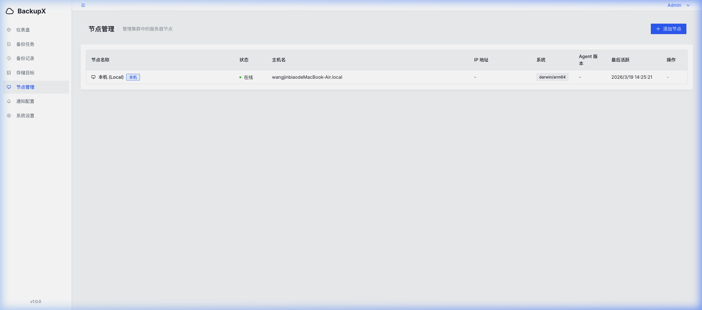
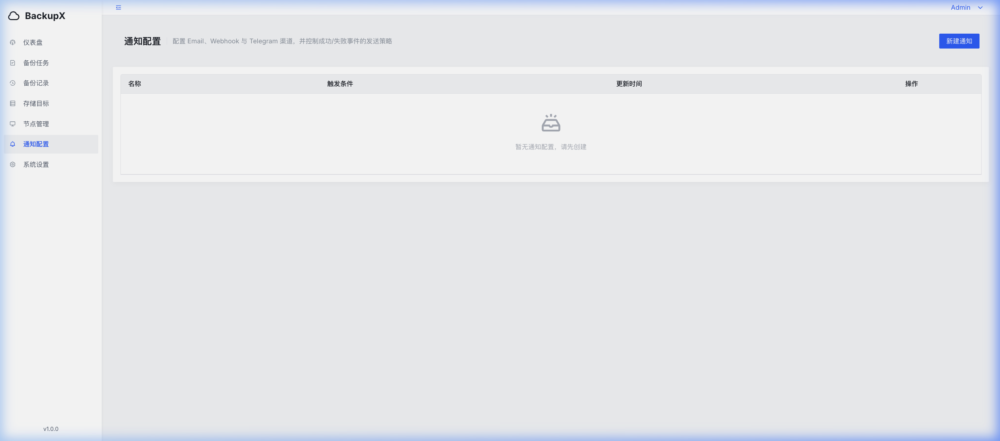
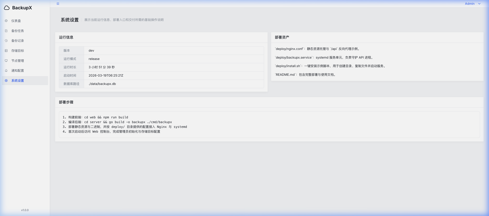

<p align="right">
  <a href="README_EN.md">English</a> | <strong>中文</strong>
</p>
<p align="center">
  <h1 align="center">🛡️ BackupX</h1>
  <p align="center">
    <strong>Self-hosted Server Backup Management Platform with Web UI</strong>
  </p>
  <p align="center">
    <a href="#features">Features</a> •
    <a href="#quick-start">Quick Start</a> •
    <a href="#configuration">Configuration</a> •
    <a href="#architecture">Architecture</a> •
    <a href="#cluster-mode">Cluster</a> •
    <a href="#development">Development</a> •
    <a href="#api-reference">API</a>
  </p>
  <p align="center">
    <a href="https://github.com/Awuqing/BackupX/stargazers"></a>
    <a href="https://github.com/Awuqing/BackupX/releases"></a>
    
    
    
    
    <a href="LICENSE"></a>
    <a href="https://github.com/Awuqing/BackupX/issues"></a>
  </p>
</p>

---

BackupX 是一个面向 **Linux / macOS 服务器**的自托管备份管理平台。通过企业级 Web 控制台，轻松配置目录备份、数据库备份，并将备份文件安全存储到阿里云 OSS、腾讯云 COS、七牛云 Kodo、Google Drive、S3 兼容存储、WebDAV、FTP/FTPS 或本地磁盘。

支持 **多节点集群管理**，可统一管控分布在不同服务器上的备份任务。

> **适用人群**：拥有 Linux 服务器的个人开发者 / 小团队 / 企业运维

## Screenshots

### 登录页面


### 仪表盘


### 备份任务


### 备份记录


### 存储目标


### 节点管理


### 通知配置


### 系统设置


## Features

### 📦 多种备份类型
- **文件/目录** — 支持自定义排除规则（如 `node_modules`、`*.log`）
- **MySQL** — 通过 `mysqldump` 原生工具
- **SQLite** — 安全文件拷贝
- **PostgreSQL** — 通过 `pg_dump` 原生工具
- **SAP HANA** — 通过 `hdbsql+backint` （支持多租户数据库）

### ☁️ 多云存储后端
| 厂商 | 类型 | 说明 |
|------|------|------|
| 🇨🇳 **阿里云 OSS** | `aliyun_oss` | 自动组装 Endpoint，支持内网传输 |
| 🇨🇳 **腾讯云 COS** | `tencent_cos` | 自动组装 Endpoint |
| 🇨🇳 **七牛云 Kodo** | `qiniu_kodo` | 6 大区域精确映射 |
| 🌍 **S3 Compatible** | `s3` | AWS S3 / MinIO / Cloudflare R2 等 |
| 🌍 **Google Drive** | `google_drive` | 完整 OAuth 2.0 授权流程 |
| 🌍 **WebDAV** | `webdav` | 坚果云 / Nextcloud 等 |
| 🌍 **FTP / FTPS** | `ftp` | 标准 FTP 协议，支持 Explicit TLS 加密 |
| 💾 **本地磁盘** | `local_disk` | 备份到服务器本地目录 |

> 国内云厂商仅需填写 **Region** 和 **AccessKey**，系统自动完成 Endpoint 组装，底层复用 S3 引擎零额外依赖。

### 🖥️ 集群管理 (Master-Agent)
- **节点管理** — 注册远程服务器节点，Token 认证
- **本机节点** — 自动创建，单机用户零感知升级
- **目录浏览** — 可视化文件树选择备份源路径，告别手动输入
- **Agent 心跳** — 节点在线状态实时监控
- **任务标签** — 按标签/节点分类管理备份任务

### ⏰ 自动化与调度
- Cron 表达式定时调度
- 可视化 Cron 编辑器
- 自动保留策略（按天数 / 按份数过期清理）
- 最大并发备份数限制

### 🔐 安全
- JWT 认证 + bcrypt 密码存储
- AES-256-GCM 加密存储敏感配置（数据库密码、OAuth Token）
- 可选备份文件加密
- 登录限流防暴力破解
- 节点 Token 认证（一次性显示，安全传输）

### 📊 监控与通知
- 仪表盘统计（成功率、存储用量、备份趋势图表）
- 邮件 / Webhook / Telegram 通知
- 实时备份执行日志 (SSE)

### 🌐 其他
- 中英文国际化 (i18n)
- 零外部依赖（内嵌 SQLite，单二进制部署）
- Docker / Docker Compose 一键部署
- systemd 服务支持

## Quick Start

### Docker 部署 (推荐)

```bash
# 克隆项目
git clone https://github.com/Awuqing/BackupX.git
cd BackupX

# 一键启动
docker compose up -d
```

如需备份宿主机上的目录，在 `docker-compose.yml` 中挂载对应路径：

```yaml
volumes:
  - backupx-data:/app/data
  - /path/to/backup/source:/mnt/source:ro
```

### 从源码构建

```bash
# 克隆项目
git clone https://github.com/Awuqing/BackupX.git
cd BackupX

# 一键构建前后端
make build

# 启动后端服务（默认监听 :8340）
cd server && ./bin/backupx
```

### 访问 Web UI

打开浏览器访问 `http://your-server:8340`，首次使用会引导您创建管理员账户。

## Configuration

配置文件路径默认为 `./config.yaml`，也可通过环境变量 `BACKUPX_` 前缀覆盖。

```yaml
# config.yaml
server:
  host: "0.0.0.0"
  port: 8340
  mode: "release"              # debug | release

database:
  path: "./data/backupx.db"    # SQLite 数据库路径

security:
  jwt_secret: ""               # 留空则自动生成
  jwt_expire: "24h"
  encryption_key: ""           # AES 加密密钥，留空自动生成

backup:
  temp_dir: "/tmp/backupx"     # 备份临时文件目录
  max_concurrent: 2            # 最大并发备份数

log:
  level: "info"                # debug | info | warn | error
  file: "./data/backupx.log"
  max_size: 100                # 日志文件大小上限 (MB)
  max_backups: 3               # 保留旧日志文件数
  max_age: 30                  # 日志保留天数
```

> 💡 `jwt_secret` 和 `encryption_key` 首次启动时自动生成并持久化到数据库，无需手动配置。

## Architecture

```
                        ┌─────────────────────┐
                        │   Nginx (反向代理)    │
                        │  / → 前端静态文件    │
                        │  /api → :8340       │
                        └─────────┬───────────┘
                                  │
                                  ▼
┌──────────────────────────────────────────────────────┐
│              BackupX Master (Go API Server)           │
│                      :8340                            │
│                                                      │
│  ┌──────┐  ┌────────────┐  ┌───────────────────────┐│
│  │ Auth │  │Backup Engine│  │  Storage Registry     ││
│  └──────┘  └──────┬─────┘  │  ┌─────────────────┐  ││
│                   │        │  │ Aliyun OSS       │  ││
│  ┌──────────┐    │        │  │ Tencent COS      │  ││
│  │ Cron     │◄───┘        │  │ Qiniu Kodo       │  ││
│  │Scheduler │             │  │ S3 Compatible    │  ││
│  └──────────┘             │  │ Google Drive     │  ││
│                           │  │ WebDAV           │  ││
│                           │  │ FTP / FTPS       │  ││
│  ┌──────────┐             │  │ Local Disk       │  ││
│  │ Notify   │             │  └─────────────────┘  ││
│  │ Module   │             └───────────────────────┘│
│  └──────────┘                                      │
│                                                      │
│  ┌──────────────┐   ┌────────────────────┐          │
│  │ Node Manager │   │ SQLite (backupx.db)│          │
│  └──────┬───────┘   └────────────────────┘          │
└─────────┼────────────────────────────────────────────┘
          │ Heartbeat / Task Dispatch
          ▼
┌──────────────────┐  ┌──────────────────┐
│   Agent Node A   │  │   Agent Node B   │
│   (远程服务器)    │  │   (远程服务器)    │
└──────────────────┘  └──────────────────┘
```

### 技术栈

| 组件 | 技术 |
|------|------|
| **后端** | Go · Gin · GORM · SQLite · robfig/cron |
| **前端** | React 18 · TypeScript · ArcoDesign · Vite · Zustand · ECharts |
| **存储** | AWS SDK v2 (S3/OSS/COS/Kodo) · Google Drive API v3 · gowebdav · jlaffaye/ftp |
| **安全** | JWT · bcrypt · AES-256-GCM |
| **日志** | zap + lumberjack (自动轮转) |

## Cluster Mode

BackupX 支持 **Master-Agent** 模式，可管理多台服务器的备份任务。

### 工作原理

1. **Master** 为运行 BackupX Web 控制台的主控服务器
2. **Agent** 部署在需要备份的远程服务器上
3. Agent 启动后通过 Token 向 Master 注册并定期发送心跳
4. Master 将备份任务下发至对应 Agent 执行

### 添加节点

```bash
# 在 Web 控制台 → 节点管理 → 添加节点
# 系统将生成一个唯一的 64 位十六进制 Token

# 在远程服务器上配置 Agent 启动参数
./backupx-agent --master http://master-server:8340 --token <your-token>
```

### 目录探针 API

Master 提供 `GET /api/nodes/:id/fs/list?path=/` 接口，可远程浏览节点的文件系统目录。前端在创建备份任务的"源路径"输入时可使用树形选择器直接浏览目标机器的目录结构。

## Project Structure

```
BackupX/
├── server/                        # Go 后端
│   ├── cmd/backupx/               #   程序入口
│   ├── internal/
│   │   ├── app/                   #   应用组装 (DI)
│   │   ├── apperror/              #   统一错误类型
│   │   ├── backup/                #   备份引擎 (file/mysql/sqlite/pgsql/saphana)
│   │   │   └── retention/         #     保留策略
│   │   ├── config/                #   配置加载 (viper)
│   │   ├── database/              #   数据库初始化 + 迁移
│   │   ├── http/                  #   HTTP 处理器 + 路由 + 中间件
│   │   ├── httpapi/               #   HTTP API 辅助工具
│   │   ├── logger/                #   日志初始化 (zap + lumberjack)
│   │   ├── model/                 #   GORM 数据模型
│   │   ├── notify/                #   通知 (email/webhook/telegram)
│   │   ├── repository/            #   数据访问层
│   │   ├── scheduler/             #   Cron 调度器
│   │   ├── security/              #   JWT + 限流
│   │   ├── service/               #   业务逻辑层
│   │   └── storage/               #   存储后端 (插件化接口)
│   │       ├── aliyun/            #     阿里云 OSS
│   │       ├── tencent/           #     腾讯云 COS
│   │       ├── qiniu/             #     七牛云 Kodo
│   │       ├── s3/                #     S3 Compatible 核心
│   │       ├── s3provider/        #     S3 Provider 辅助
│   │       ├── googledrive/       #     Google Drive
│   │       ├── webdav/            #     WebDAV 核心
│   │       ├── webdavprovider/    #     WebDAV Provider 辅助
│   │       ├── localdisk/         #     本地磁盘
│   │       ├── ftp/               #     FTP / FTPS
│   │       └── codec/             #     配置编解码
│   └── pkg/                       #   工具包 (compress/crypto/response)
├── web/                           # React 前端
│   └── src/
│       ├── components/            #   通用组件 (CronEditor/FormDrawer/...)
│       ├── hooks/                 #   自定义 Hooks
│       ├── layouts/               #   布局组件 (AppLayout)
│       ├── pages/                 #   页面模块
│       │   ├── dashboard/         #     仪表盘
│       │   ├── backup-tasks/      #     备份任务
│       │   ├── backup-records/    #     备份记录
│       │   ├── storage-targets/   #     存储目标
│       │   ├── nodes/             #     节点管理
│       │   ├── notifications/     #     通知配置
│       │   ├── settings/          #     系统设置
│       │   └── login/             #     登录页
│       ├── services/              #   API 请求封装
│       ├── stores/                #   Zustand 状态管理
│       ├── styles/                #   全局样式
│       ├── types/                 #   TypeScript 类型定义
│       ├── utils/                 #   工具函数
│       ├── locales/               #   i18n 语言包 (zh-CN / en-US)
│       └── router/                #   路由配置
├── deploy/                        # 部署配置
│   ├── nginx.conf                 #   Nginx 参考配置
│   ├── backupx.service            #   systemd 服务单元
│   ├── install.sh                 #   一键安装脚本
│   └── docker/                    #   Docker 部署配置
│       ├── nginx.conf             #     容器内 Nginx 配置
│       └── entrypoint.sh          #     容器启动脚本
├── .github/                       # GitHub 配置
│   ├── workflows/ci.yml           #   CI 工作流
│   ├── workflows/release.yml      #   Release 工作流
│   └── ISSUE_TEMPLATE/            #   Issue 模板
├── Dockerfile                     # Docker 多阶段构建
├── docker-compose.yml             # Docker Compose 配置
└── Makefile                       # 构建命令
```

## Development

### 前置条件

- **Go** ≥ 1.21
- **Node.js** ≥ 18
- **npm**

### 开发模式

```bash
# 终端 1：启动后端 (热重载需配合 air)
make dev-server

# 终端 2：启动前端 (Vite HMR)
make dev-web
```

### 运行测试

```bash
# 运行全部测试
make test

# 仅后端
make test-server    # go test ./...

# 仅前端
make test-web       # npm run test
```

### 构建

```bash
# 构建前后端
make build

# 清理构建产物
make clean
```

## Deployment

### 一键安装 (推荐)

```bash
# 先构建
make build

# 以 root 执行安装脚本
sudo ./deploy/install.sh
```

安装脚本将自动：
1. 创建 `backupx` 系统用户
2. 安装二进制到 `/opt/backupx/bin/`
3. 部署前端到 `/opt/backupx/web/`
4. 生成配置文件 `/etc/backupx/config.yaml`
5. 注册并启动 systemd 服务
6. 配置 Nginx 反向代理（如已安装）

### Docker 部署

```bash
# 使用 docker compose
docker compose up -d

# 或手动构建镜像
docker build -t backupx .
docker run -d --name backupx -p 8340:8340 -v backupx-data:/app/data backupx
```

通过环境变量覆盖配置：

```bash
docker run -d --name backupx \
  -p 8340:8340 \
  -v backupx-data:/app/data \
  -e TZ=Asia/Shanghai \
  -e BACKUPX_LOG_LEVEL=debug \
  -e BACKUPX_BACKUP_MAX_CONCURRENT=4 \
  backupx
```

### 手动部署

```bash
# 1. 构建
cd server && go build -o backupx ./cmd/backupx
cd ../web && npm run build

# 2. 部署文件
scp server/backupx your-server:/opt/backupx/bin/
scp -r web/dist/ your-server:/opt/backupx/web/
scp server/config.example.yaml your-server:/etc/backupx/config.yaml

# 3. 启动
ssh your-server '/opt/backupx/bin/backupx -config /etc/backupx/config.yaml'
```

### Nginx 配置示例

```nginx
server {
    listen 80;
    server_name backup.example.com;

    # 前端静态文件
    location / {
        root /opt/backupx/web;
        try_files $uri $uri/ /index.html;
    }

    # API 反向代理
    location /api/ {
        proxy_pass http://127.0.0.1:8340;
        proxy_set_header Host $host;
        proxy_set_header X-Real-IP $remote_addr;
    }
}
```

## API Reference

所有 API 均以 `/api` 为前缀，使用 JWT Bearer Token 认证（除特殊标注外）。

| 模块 | 端点 | 说明 |
|------|------|------|
| **认证** | `POST /api/auth/setup` | 首次初始化管理员 |
| | `POST /api/auth/login` | 登录获取 Token |
| | `POST /api/auth/logout` | 登出 |
| | `GET /api/auth/profile` | 当前用户信息 |
| | `PUT /api/auth/password` | 修改密码 |
| **备份任务** | `GET/POST /api/backup/tasks` | 任务列表 / 创建 |
| | `GET/PUT/DELETE /api/backup/tasks/:id` | 详情 / 更新 / 删除 |
| | `PUT /api/backup/tasks/:id/toggle` | 启用/禁用 |
| | `POST /api/backup/tasks/:id/run` | 手动触发执行 |
| **备份记录** | `GET /api/backup/records` | 记录列表 (支持筛选) |
| | `GET /api/backup/records/:id` | 记录详情 |
| | `GET /api/backup/records/:id/logs/stream` | 实时执行日志 (SSE) |
| | `GET /api/backup/records/:id/download` | 下载备份文件 |
| | `POST /api/backup/records/:id/restore` | 恢复备份 |
| **存储目标** | `GET/POST /api/storage-targets` | 存储列表 / 添加 |
| | `GET/PUT/DELETE /api/storage-targets/:id` | 详情 / 更新 / 删除 |
| | `POST /api/storage-targets/test` | 测试连接 |
| | `POST /api/storage-targets/:id/test` | 测试已保存连接 |
| | `GET /api/storage-targets/:id/usage` | 查询用量 |
| **节点管理** | `GET/POST /api/nodes` | 节点列表 / 添加 |
| | `GET/DELETE /api/nodes/:id` | 详情 / 删除 |
| | `GET /api/nodes/:id/fs/list` | 目录浏览 |
| | `POST /api/agent/heartbeat` | Agent 心跳 ⚡ |
| **通知** | `GET/POST /api/notifications` | 通知列表 / 添加 |
| | `POST /api/notifications/test` | 测试通知 |
| | `POST /api/notifications/:id/test` | 测试已保存通知 |
| **仪表盘** | `GET /api/dashboard/stats` | 概览统计 |
| | `GET /api/dashboard/timeline` | 备份趋势时间线 |
| **系统** | `GET /api/system/info` | 系统信息 (版本/磁盘) |
| | `GET/PUT /api/settings` | 系统设置读写 |

> ⚡ `POST /api/agent/heartbeat` 为公开端点，使用 Node Token 认证而非 JWT。

## 云存储配置指南

### 阿里云 OSS

1. 登录[阿里云控制台](https://oss.console.aliyun.com/)，创建 Bucket
2. 前往 RAM 控制台创建 AccessKey
3. 在 BackupX 添加存储目标时选择"阿里云 OSS"
4. 填写 Region（如 `cn-hangzhou`）和 AccessKey，系统自动组装 Endpoint

### 腾讯云 COS

1. 登录[腾讯云控制台](https://console.cloud.tencent.com/cos)，创建存储桶
2. 前往 API 密钥管理创建 SecretId/SecretKey
3. Bucket 名称格式为 `BucketName-APPID`（如 `backup-1250000000`）

### 七牛云 Kodo

1. 登录[七牛云控制台](https://portal.qiniu.com/)，创建存储空间
2. 支持区域：`z0`(华东) / `cn-east-2`(华东-浙江2) / `z1`(华北) / `z2`(华南) / `na0`(北美) / `as0`(东南亚)

### Google Drive

1. 前往 [Google Cloud Console](https://console.cloud.google.com/) 创建项目
2. 启用 **Google Drive API**
3. 创建 **OAuth 2.0 客户端 ID**（Web 应用类型）
4. 添加重定向 URI：`http://your-server/api/storage-targets/google-drive/callback`
5. 在 BackupX 存储管理页面填入 Client ID / Secret，点击授权

## Contributing

欢迎提交 Issue 和 Pull Request！

1. Fork 本项目
2. 创建功能分支 (`git checkout -b feature/amazing-feature`)
3. 提交更改 (`git commit -m 'Add amazing feature'`)
4. 推送到分支 (`git push origin feature/amazing-feature`)
5. 创建 Pull Request

## License

本项目采用 [Apache License 2.0](LICENSE) 开源协议。

---

<p align="center">
  Made with ❤️ for self-hosters
</p>
